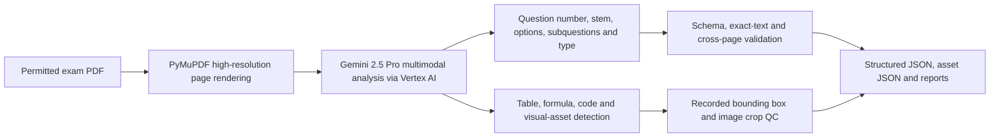

# MIS-Teach Exam Transcription

Turn a permitted examination PDF collection into structured question JSON and visual-asset metadata for later human review, standard-answer generation, and question-bank import.

This is an **offline data-preparation tool**, not a Web runtime service. It does not automatically import results into MongoDB; a human review and import step is required because a complete automatic `transcription JSON → MongoDB` bridge is not part of this public package.

## Contents

- [What the pipeline does](#what-the-pipeline-does)
- [Requirements and environment variables](#requirements-and-environment-variables)
- [Input and output](#input-and-output)
- [Run the pipeline](#run-the-pipeline)
- [Structured-content rules](#structured-content-rules)
- [Validation and success checks](#validation-and-success-checks)
- [Synthetic example and testing](#synthetic-example-and-testing)
- [Troubleshooting and limitations](#troubleshooting-and-limitations)

## What the pipeline does



The public entry point, `scripts/run_pipeline.py`, directly runs `src/pipeline.py`. The public filename is normalized; it is an unchanged functional copy of the latest local strict pipeline, including its model, prompts, validation, crop QC, and output contract.

The source workflow renders whole pages at high resolution with PyMuPDF and uses multimodal model interpretation for question layout and visual content. It does **not** describe OCR, YOLO, or a PDF text layer as the primary current extraction path.

## Requirements and environment variables

Windows PowerShell:

```powershell
git clone https://github.com/THEHAPPYMAN779991/MIS-Teach-Exam-Transcription.git
Set-Location .\MIS-Teach-Exam-Transcription
python -m venv .venv
.\.venv\Scripts\Activate.ps1
python -m pip install -r requirements.txt
Copy-Item .env.example .env
```

macOS / Linux Bash:

```bash
git clone https://github.com/THEHAPPYMAN779991/MIS-Teach-Exam-Transcription.git
cd MIS-Teach-Exam-Transcription
python3 -m venv .venv
source .venv/bin/activate
python -m pip install -r requirements.txt
cp .env.example .env
```

Configure Vertex AI authentication using your own Google Cloud account. The source uses Gemini 2.5 Pro through Vertex AI and will use application-default credentials when available.

| Variable | Required | Purpose | Example |
| --- | --- | --- | --- |
| `GOOGLE_CLOUD_PROJECT` or `GCP_PROJECT` | Yes, unless detected by local Google authentication | Google Cloud project | `YOUR_PROJECT_ID` |
| `GOOGLE_CLOUD_LOCATION` or `GCP_LOCATION` | Optional | Vertex location | `us-central1` |

`.env`, `api.env`, and `gcp.env` are local-only compatibility configuration files and are ignored. No API key, real PDF, image, or research output belongs in Git.

## Input and output

Place only permitted PDF files under a local input directory. The default source argument is `exam_img`, but the recommended public command passes an explicit ignored folder such as `input/`.

```text
input/
└── permitted_exam.pdf
```

A normal run creates a unique `run_YYYYMMDD_HHMMSS` directory under the chosen output root:

```text
generated/
└── run_YYYYMMDD_HHMMSS/
    ├── new_exam_output.json       # aggregated structured questions
    ├── new_exam_assets.json       # aggregated asset metadata
    ├── results/                   # per-PDF question and asset bundle
    ├── batch_summary.json          # one status record per source PDF
    ├── cost_report.json            # model usage/cost metadata
    ├── conversion_summary.md       # human-readable run summary
    ├── failed_files.txt            # failed PDF list, if any
    └── run_manifest.json           # run configuration and provenance
```

`input/` and `generated/` are ignored intentionally. The run manifest records local absolute paths for provenance, so it is generated data and must not be published.

## Run the pipeline

First validate that Vertex AI is reachable:

```powershell
python .\scripts\run_pipeline.py --preflight `
  --pdf-folder .\input `
  --output-root .\generated
```

Then run the full conversion:

```powershell
python .\scripts\run_pipeline.py `
  --pdf-folder .\input `
  --output-root .\generated `
  --max-schema-repairs 2 `
  --max-post-crop-qc-rounds 3
```

Useful source-confirmed controls:

| Option | Purpose |
| --- | --- |
| `--pdf-folder` | Directory containing PDF inputs. |
| `--output-root` | Parent directory for a unique generated run. |
| `--preflight` | Sends a minimal Vertex AI connectivity check before processing. |
| `--gcp-project` / `--gcp-location` | Explicitly override local project/location discovery. |
| `--max-schema-repairs` | Maximum schema-repair attempts; default `2`. |
| `--max-post-crop-qc-rounds` | Maximum crop visual-QC attempts; default `3`. |
| `--no-fresh-run` | Reuse the output root rather than creating a timestamped run directory. |

## Structured-content rules

The output distinguishes text that can be represented structurally from visual material that must be retained as an image asset.

| Source content | Expected representation |
| --- | --- |
| Ordinary question text, options and subquestions | Structured text fields in question JSON. |
| Table | HTML / structured table representation when independently readable and validated. |
| Mathematical formula | LaTeX representation when readable and validated. |
| Program code | Code block or structured code representation; it is not converted into LaTeX. |
| Flowchart, tree, statistical graph, circuit, handwritten work, or complex spatial visual | Asset entry with page provenance, bounding box, crop path, type, and description. |
| Cross-page question or shared image | Source-page and asset-reference metadata are retained for review and presentation. |

The strict pipeline performs schema checks, candidate-free coverage checks, exact-text rereading, and post-crop visual QC. An item marked for review is not an automatic approval; human review remains necessary before using output as a question bank.

## Validation and success checks

A conversion is ready for human review when all of the following are true:

1. `batch_summary.json` records `SUCCESS` or a reviewable `SUCCESS_WITH_REVIEW` result for each intended PDF.
2. `new_exam_output.json` and `new_exam_assets.json` parse as JSON.
3. `conversion_summary.md` reports the expected question and asset counts.
4. `failed_files.txt` is empty, or every listed file has been resolved deliberately.
5. Any `needs_review` question, image crop, formula, table, or code representation is checked by a human before answer generation or import.

After review, use the Backend companion's `tool/generate_multi_agent_answers.py` to generate proposed standard answers. The public package does not claim that transcription output is automatically imported into MongoDB.

## Synthetic example and testing

`examples/demo_transcription_output.json` is invented data showing the output shape only. It is not a real examination and cannot be fed into the PDF conversion command.

```powershell
python -m unittest discover -s tests
python .\scripts\run_pipeline.py --help
```

These commands verify the public Python source and CLI availability without a cloud request. Running `--preflight` or a PDF conversion needs Vertex AI credentials and is therefore external-service dependent.

## Troubleshooting and limitations

| Symptom | Check |
| --- | --- |
| `Google Cloud Project ID` error | Set `GOOGLE_CLOUD_PROJECT` / `GCP_PROJECT`, pass `--gcp-project`, or configure application-default credentials. |
| Authentication error | Run the appropriate local Google Cloud authentication flow; do not paste credentials into source or Git. |
| No PDF found | Confirm `--pdf-folder` exists and contains `.pdf` files. |
| `FAILED` in batch summary | Read `failed_files.txt`, retain the generated run locally, correct input/configuration, then create a fresh run. |
| Output has review flags | Inspect the question, source page and crop. Review flags are a quality-control signal, not an automatic correction. |
| Need to import into MIS-Teach | Perform human review and use your approved local import workflow; no automatic public bridge is verified here. |

## Related repositories

- [MIS-Teach Parent](https://github.com/THEHAPPYMAN779991/MIS-Teach)
- [MIS-Teach Backend](https://github.com/THEHAPPYMAN779991/MIS-Teach-Backend)
- [MIS-Teach Frontend](https://github.com/THEHAPPYMAN779991/MIS-Teach-Frontend)
- [MIS-Teach Knowledge Graph](https://github.com/THEHAPPYMAN779991/MIS-Teach-Knowledge-Graph)

## License

Formal licensing terms are pending an owner decision before public release. See the Parent repository's `LICENSE_DECISION_REQUIRED.md`.
